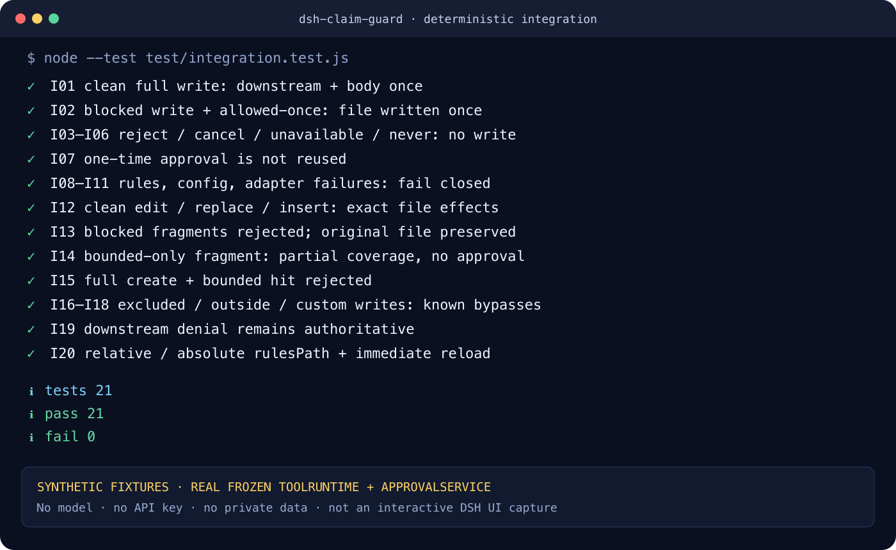

# dsh-claim-guard

[中文](#中文) · [English](#english)

`dsh-claim-guard` is a deterministic pre-write claim guard for supported
DeepSeek Harness file tools. It is a **non-official community project**,
independently developed and maintained by `xuxucodepractice-code`; it is not
published, certified, maintained, or endorsed by DeepSeek.



## English

### What it does

Before a verified DSH file tool writes text, the plugin reads a user-maintained
JSON rule file and inspects the new text. A `blocked` phrase or an unbounded
`bounded` phrase returns DSH's native `ask` decision. DSH's existing approval
service decides whether that one execution proceeds.

The checked-in source does not claim a future release or CI run has passed.
Project status words are evidence-bound: see [Status and compatibility](#status-and-compatibility)
and the commit-scoped CI/Release evidence once published.

### Status and compatibility

| Component | Exact candidate | Evidence rule |
| --- | --- | --- |
| DeepSeek Harness | `0.1.1-rc.2`, tag `dsh-v0.1.1-rc.2`, commit `b150a551b8d465e31e418e1b2eaf5e79bbb7d28e` | `verified` only after this exact release commit passes required CI and artifact gates |
| Node | `22.19.0`, `24.15.0` | each version must pass the same required CI matrix |
| pnpm | `11.7.0` | exact install/profile command baseline |
| npm | `11.12.1` | exact release-pack baseline |
| Platforms | macOS, Linux CI | other platforms are untested |

`implemented`, `integrated`, `release-candidate`, `released-github`, and
`shared-dsh-community` describe different evidence levels; one never implies
the next. The immutable API and dependency evidence is in [RECON.md](RECON.md).

### Install from a GitHub Release tarball

The first distribution plan is GitHub-only. There is no npm install claim.
After `v0.1.0` is published, download both
`dsh-claim-guard-0.1.0.tgz` and its `.sha256` file from the
[GitHub Release](https://github.com/xuxucodepractice-code/dsh-claim-guard/releases/tag/v0.1.0),
then verify before installing:

```sh
shasum -a 256 -c dsh-claim-guard-0.1.0.tgz.sha256
mkdir -p claim-guard-workspace
cp claims.example.json claim-guard-workspace/claims.json
dsh plugin --profile claim-guard-smoke add ./dsh-claim-guard-0.1.0.tgz
cd claim-guard-workspace
dsh --profile claim-guard-smoke --dump-config
dsh --profile claim-guard-smoke
```

Use a dedicated profile first. The required order is: prepare a valid rules
file, install/enable the plugin, then run synthetic blocked and clean writes.
If the rules file is missing or invalid, covered writes fail closed. The one
self-repair exception is writing the resolved rules file itself, which the
plugin always excludes.

### Configuration

The bundle inserts this default row:

```yaml
- insert:
    - id: dsh-claim-guard
      name: dsh-claim-guard
      config:
        rulesPath: claims.json
        include: ["**/*.md", "**/*.mdx", "**/*.txt"]
        exclude: []
```

`rulesPath` may be relative to `exec.agent.session.header.cwd`, or an explicitly
configured absolute path outside the workspace. Target paths are still
classified relative to the session workspace. `exclude` wins over `include`;
`include: []` includes every workspace target. Unknown config fields, explicit
`null`, blank values, and wrong types are rejected.

Rules are strict UTF-8 JSON, not YAML and not JSON-with-comments:

```json
{
  "version": 1,
  "options": { "window": 60, "caseSensitive": false },
  "blocked": [
    {
      "id": "manuscript-status",
      "match": "submitted",
      "message": "The synthetic demo manuscript is only in preparation."
    }
  ],
  "bounded": [
    {
      "id": "demo-composite-score",
      "match": "42.5%",
      "mustAccompany": ["synthetic benchmark", "合成示例"],
      "message": "This invented demo value must be labelled as synthetic."
    }
  ]
}
```

The rule file is limited to 262,144 bytes and 1–256 total rules. Input text is
limited to 1,000,000 JavaScript UTF-16 code units. Matching is literal
substring matching; case-insensitive mode uses ECMAScript `toLowerCase()` and
does not add normalization, tokenization, fuzzy matching, or synonyms.

### Covered tools and approval behavior

| Tool | Operation | Coverage |
| --- | --- | --- |
| `write` | all writes | full new text; `blocked` and `bounded` |
| `edit` | replacement/deletion | new fragment only; `blocked` only |
| `str_replace_editor` | `create` | full new text; `blocked` and `bounded` |
| `str_replace_editor` | `str_replace`, `insert` | new fragment only; `blocked` only |
| `str_replace_editor` | `view` | not applicable; delegated unchanged |

A clean full write and a fragment with no `blocked` hit delegate to the next
policy. A match requests approval; only DSH's `allowed-once` outcome executes
the tool body. Rejected, cancelled, unavailable/no-responder, missing approval,
and `never` policy outcomes do not execute it. Each hit asks again; an earlier
one-time grant is not cached. Downstream policy can still deny a clean write.

Rules/config/workspace/known-adapter failures return a bounded `deny` reason;
they cannot be approved as ordinary content. Reports show at most 20 complete
hits and 6,000 UTF-16 code units, with short escaped excerpts rather than the
whole document.

### Data flow and permissions

- The plugin reads the configured rules file, normally inside the session
  workspace; an explicit absolute `rulesPath` may point outside it.
- The pre-execute hook sees new text arguments for the supported file tools.
- A matching excerpt and reason can enter the DSH approval UI and session audit.
- The plugin itself makes no network requests, provides no telemetry, and does
  not directly write the target file.
- DSH may still access models, networks, files, and logs according to its own
  configuration.
- A community plugin runs in the same process as DSH. Local execution alone is
  not a security guarantee. Review the source and pin the release/checksum.
- Never put secret rules or text in public issues, screenshots, or CI. Avoid
  making a large secret value itself a rule match because excerpts may persist.

### What it does not do

This is not a fact checker, content rewriter, DLP system, malware detector,
sandbox, or malicious-host boundary. It cannot infer truth or semantic
equivalence. Bash, PowerShell, Python, Node scripts, MCP tools, third-party or
unknown write tools, host-internal writes, binary content, and paths outside the
session workspace can bypass it. Incremental edits are not reconstructed, so a
deletion can create a whole-file violation that v1 does not detect.

### Why reuse DSH approval

The plugin returns the documented native `ask` decision instead of creating a
second prompt, policy, or audit mechanism. This keeps one authoritative approval
outcome and preserves DSH's cancellation, no-responder, and session-audit
behavior. It does not make the plugin an official DSH component.

### Upgrade, disable, uninstall, and troubleshoot

Install an upgraded checksummed tarball into a disposable profile and repeat
the synthetic smoke before changing an important profile. A profile-local patch
can disable the same row without changing its identity:

```yaml
- id: dsh-claim-guard
  disabled: true
```

Remove the package and bundle layer with:

```sh
dsh plugin --profile claim-guard-smoke remove dsh-claim-guard
```

Common failures:

- `RULE_FILE_UNREADABLE` or invalid rules: restore a valid `claims.json`; the
  rules file itself remains writable for recovery.
- A write was not checked: confirm the exact DSH/tool version, tool name,
  workspace boundary, include/exclude patterns, and that the plugin row is
  enabled. Unknown tools and outside-workspace paths are deliberately uncovered.
- A fragment passed without a bounded phrase: bounded checks require full text
  and intentionally do not run for incremental edits in v1.
- No approval UI: DSH fails the ask closed when no responder is available.

See [SECURITY.md](SECURITY.md) for private reporting and [CONTRIBUTING.md](CONTRIBUTING.md)
for synthetic reproductions. Report ordinary bugs through the issue tracker
after removing private data.

### Roadmap

- Research exact full-file reconstruction for incremental edits.
- Add compatibility baselines only after source and integration re-verification.
- Consider an optional read-only `claim_check` convenience tool after the
  automatic hook remains fully gated.
- Evaluate npm distribution separately; GitHub Release remains the v0.1.0 plan.

### License

MIT. See [LICENSE](LICENSE).

## 中文

### 作用与身份

`dsh-claim-guard` 是一个面向已验证 DeepSeek Harness 文件工具的确定性写前
声明检查插件。它是由 `xuxucodepractice-code` 独立开发维护的**非官方社区项目**，
并非 DeepSeek 发布、认证、维护或背书的官方组件。

在受支持工具写入之前，插件读取用户维护的 JSON 规则，检查即将写入的新文本。
命中 `blocked`，或完整文本中的 `bounded` 表述缺少邻近限定词时，插件返回 DSH
原生 `ask`，由宿主已有审批流决定这一次是否执行。源码不提前声称未来 Release
或 CI 已成功；兼容性只有在同一 commit 的两档 CI 与制品门禁完成后才是
`verified`。

### 安装与启用顺序

首发采用 `github-only`，不宣称 npm 已发布。`v0.1.0` 发布后，从
[GitHub Release](https://github.com/xuxucodepractice-code/dsh-claim-guard/releases/tag/v0.1.0)
下载 `.tgz` 与 `.sha256`，先校验，再安装到专用 profile：

```sh
shasum -a 256 -c dsh-claim-guard-0.1.0.tgz.sha256
mkdir -p claim-guard-workspace
cp claims.example.json claim-guard-workspace/claims.json
dsh plugin --profile claim-guard-smoke add ./dsh-claim-guard-0.1.0.tgz
cd claim-guard-workspace
dsh --profile claim-guard-smoke --dump-config
dsh --profile claim-guard-smoke
```

固定顺序是：**准备并校验规则 → 安装/启用 → 用合成内容 smoke test**。
缺失、不可读、损坏或 schema 非法的规则会让纳入范围的写入失败关闭。唯一恢复
例外是规则文件自身始终排除，所以可以先创建或修复它。

### 配置与规则

默认 `rulesPath` 是相对 session workspace 的 `claims.json`，也可显式配置仓库外
绝对路径；目标文件仍按 session workspace 分类。`exclude` 优先于 `include`，
`include: []` 表示 workspace 内所有目标。配置不接受未知字段、`null`、空白值
或错误类型。

规则必须是 UTF-8 严格 JSON，只包含 `version`、`options`、`blocked`、
`bounded` 规定字段。规则文件不超过 262,144 bytes，总规则 1–256 条，单次文本
不超过 1,000,000 个 UTF-16 code units。匹配是确定性的字面子串，不是事实判断、
正则、分词、模糊匹配或语义推理。完整合成示例见
[claims.example.json](claims.example.json)。

### 覆盖、审批与失败关闭

- `write`：检查完整新文本的 `blocked` 与 `bounded`。
- `edit`：只检查 `new_string` 片段内的 `blocked`。
- `str_replace_editor/create`：检查完整新文本的两类规则。
- `str_replace_editor/str_replace` 与 `insert`：只检查新片段内的 `blocked`。
- `view`、排除路径调用后续策略；未知工具和 workspace 外路径同样继续，但属于
  **未覆盖**，不能称为 `pass`。

命中后每次都重新请求审批；只有 `allowed-once` 执行。拒绝、取消、无 responder、
approval 不可用或 `never` policy 都不会执行。干净调用仍保留下游策略的决定。
规则、配置、可信 workspace 或已知 adapter 出错时直接 `deny`，不会“警告后放行”。

### 数据流、权限与边界

插件读取规则文件，并能看到受支持工具的新文本参数。命中 excerpt/reason 可能进入
DSH 审批 UI 与 session audit。插件自身不联网、无遥测、不直接写目标文件；但
DSH 仍可按自身配置访问模型、网络、文件和日志。第三方插件与 DSH 同进程运行，
“本地运行”不等于安全保证，应审阅源码并固定 Release 与 checksum。

它不是事实核查器、自动改写器、DLP、安全沙箱或恶意宿主隔离层。Shell/Python/
Node、MCP、第三方/未知工具、宿主内部写入、workspace 外路径和二进制内容都可
绕过。增量编辑不重建全文，因此删除旧限定词造成的新全文违规可能无法发现。

### 升级、禁用、卸载与故障排查

升级前先在一次性 profile 中安装新的 checksummed tarball 并重复合成 smoke。
用同一 row id 加 `disabled: true` 可禁用；卸载命令是：

```sh
dsh plugin --profile claim-guard-smoke remove dsh-claim-guard
```

若规则错误，先修复 `claims.json`；若写入未被检查，核对冻结 DSH 版本、工具名、
workspace、include/exclude 与 row enabled 状态；若片段中仅有 bounded 风险却未审批，
这是 v1 的明确边界；若没有 approval responder，DSH 会失败关闭。

安全问题请按 [SECURITY.md](SECURITY.md) 私下报告；普通 bug 使用脱敏、完全合成的
复现。Roadmap 包括精确重建增量编辑全文、经证据扩展兼容版本、可选只读
`claim_check`，以及未来单独评估 npm 分发。

许可证：MIT。
